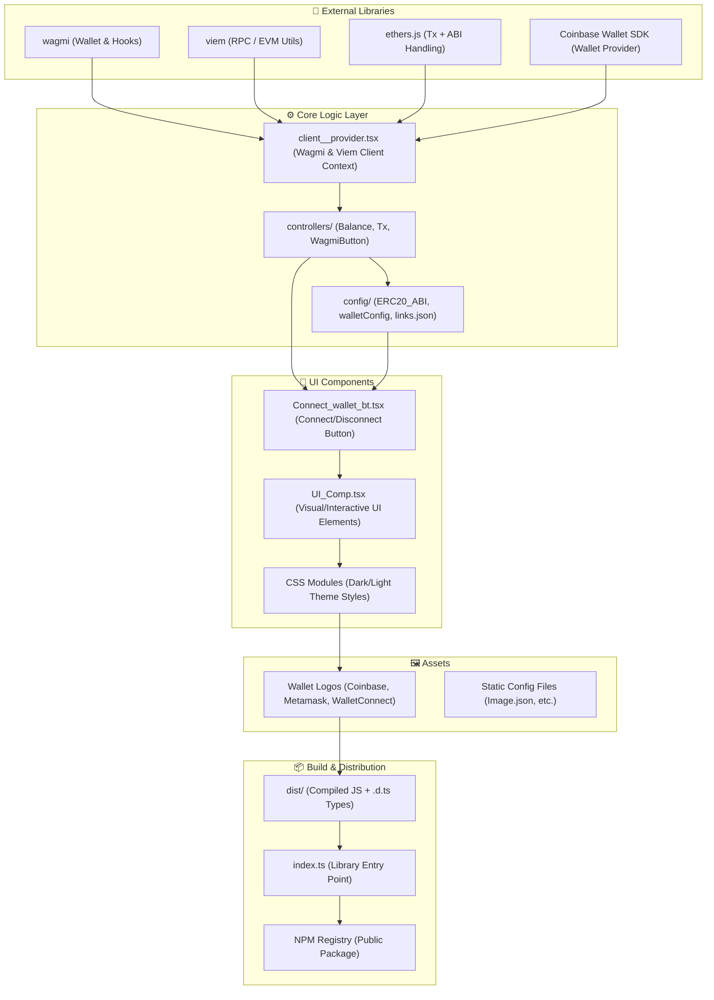

---
© 2025 Cordy StackX (@cordystackx)  
Licensed under the MIT License.  
Unauthorized removal of this notice violates the license terms.
---

# 🧩 Cordy MiniKit — Web3 Toolkit by CordyStackX

[](https://www.npmjs.com/package/@cordystackx/cordy_minikit)
[](https://opensource.org/licenses/MIT)

A lightweight, production-ready Web3 toolkit for building wallet UIs, controllers, and provider wrappers — designed for modern frameworks like **Next.js** and **Vite**.  
Built with **Wagmi**, **Viem**, **Ethers**, and **TypeScript**.

**📦 [NPM Package](https://www.npmjs.com/package/@cordystackx/cordy_minikit)** | **📂 [GitHub Repository](https://github.com/cordyStackX/cordy_minikit_official)**

---

## 🚀 Features

- 🔗 **Wallet Connect/Disconnect** — Simple hooks and buttons for EVM-based wallets
- 🧰 **Prebuilt UI Components** — Ready-to-use `ConnectWalletBT`, `UI_Comp`, and more
- ⚙️ **Smart Controllers** — Manage wallet actions, balances, and transactions effortlessly
- 💸 **Transaction Helpers** — Built-in ERC20 and native token transfer functions
- 🎨 **Themeable CSS** — CSS Modules with variables for easy dark/light mode support
- 📦 **Tree-shakable & Typed** — Optimized bundle size with full TypeScript definitions
- 🧩 **Framework-Agnostic** — Works seamlessly with Next.js, Vite, and more
- 🌐 **Multi-Chain Support** — Custom chain configuration support

---

## 📦 Installation

```bash
npm install @cordystackx/cordy_minikit@latest
# or
pnpm add @cordystackx/cordy_minikit@latest
# or
yarn add @cordystackx/cordy_minikit@latest
```

---

## 🛠️ Quick Start

### 1. Environment Setup

Create a `.env.local` file in your project root:

```bash
NEXT_PUBLIC_RPC_ENDPOINT=https://your-rpc-endpoint.com
NEXT_PUBLIC_TOKENADDRESS=0x...
NEXT_PUBLIC_PLATFORM_ADDRESS=0x...
NEXT_PUBLIC_WALLETCONNECT_PROJECT_ID=your_project_id
```

### 2. Provider Setup

Create a providers file at `/app/providers.tsx` or `/services/minikit/providers.tsx`:

```tsx
"use client";
import { ReactNode } from "react";
import { ProvidersClientWrapper } from "@cordystackx/cordy_minikit";
import { QueryClient, QueryClientProvider } from "@tanstack/react-query";

const queryClient = new QueryClient();

export default function Providers({ children }: { children: ReactNode }) {
  return (
    <QueryClientProvider client={queryClient}>
      <ProvidersClientWrapper>
        {children}
      </ProvidersClientWrapper>
    </QueryClientProvider>
  );
}
```

> **Note:** Install `@tanstack/react-query` as a peer dependency:
> ```bash
> npm install @tanstack/react-query
> ```

### 3. Layout Integration

Import the providers and CSS in your `/app/layout.tsx`:

```tsx
import Providers from "@/app/providers";
import "@cordystackx/cordy_minikit/dist/css/UI_Comp/styles.module.css";

export default function RootLayout({
  children,
}: {
  children: React.ReactNode;
}) {
  return (
    <html lang="en">
      <body>
        <Providers>
          {children}
        </Providers>
      </body>
    </html>
  );
}
```

---

## 📚 Usage Examples

### 1. Connect Wallet Button

The `ConnectWalletBT` component provides a plug-and-play wallet connection button.

```tsx
import { ConnectWalletBT } from "@cordystackx/cordy_minikit";

export default function Header() {
  return (
    <nav>
      <ConnectWalletBT className="your-custom-class" />
    </nav>
  );
}
```

**Features:**
- Automatically shows "Connect Wallet" when disconnected
- Displays wallet address when connected
- Fully customizable with `className` prop

---

### 2. Wallet Modal Hook

Use the `useWalletModal` hook to trigger the wallet modal programmatically:

```tsx
import { useWalletModal } from "@cordystackx/cordy_minikit";

function CustomButton() {
  const { openModal, closeModal } = useWalletModal();

  return (
    <button onClick={openModal}>
      Open Wallet
    </button>
  );
}
```

---

### 3. Transaction Handler

The `CordyStackTrans` function handles ERC20 and native token transfers:

```tsx
import { CordyStackTrans } from "@cordystackx/cordy_minikit";

async function handlePayment() {
  const recipientAddress = "0x...";
  const amount = 10; // Token amount

  const success = await CordyStackTrans(recipientAddress, amount);

  if (success) {
    console.log("Transaction successful!");
  } else {
    console.log("Transaction failed or rejected");
  }
}
```

---

### 4. Custom UI Component

The `UI_Comp` component displays wallet connection UI with balance information:

```tsx
import { UI_Comp } from "@cordystackx/cordy_minikit";

export default function WalletUI() {
  return <UI_Comp title="My Custom Wallet" />;
}
```

**Props:**
- `title` (optional): Custom title for the wallet modal (defaults to "Cordy Minikit")

---

### 5. Custom Chain Support

Configure custom chains for your dApp:

```tsx
import { getConfig, ProvidersClientWrapper } from "@cordystackx/cordy_minikit";
import { defineChain } from "viem";

// Define your custom chain
const myCustomChain = defineChain({
  id: 1114,
  name: "Core Blockchain Testnet",
  network: "core-testnet",
  nativeCurrency: { name: "tCORE", symbol: "tCORE", decimals: 18 },
  rpcUrls: {
    default: { http: ["https://rpc.test.btcs.network"] },
    public: { http: ["https://rpc.test.btcs.network"] },
  },
  blockExplorers: {
    default: { name: "Core Scan", url: "https://scan.test.btcs.network" },
  },
});

// Get config with custom chain
const customConfig = getConfig({ myCustomChain });

// Use in provider
export default function Providers({ children }: { children: ReactNode }) {
  return (
    <ProvidersClientWrapper config={customConfig}>
      {children}
    </ProvidersClientWrapper>
  );
}
```

---

## 🏗️ Architecture Overview

### Project Structure

```
cordy_minikit/
├── assets/          # Image Sources for logo
├── components/      # UI components (ConnectWalletBT, UI_Comp)
├── controllers/     # Transaction logic and wallet operations
├── config/          # ABIs and static configurations
├── css/             # CSS Modules and theming
├── dist/            # Compiled output (published to npm)
├── index.ts         # Main export entry point
└── package.json
```

### Key Files

| File/Folder | Description |
|-------------|-------------|
| `assets/` | Image Sources for logo |
| `client__provider.tsx` | React provider wrapper for Wagmi/Viem |
| `components/` | Reusable UI components for wallet interactions |
| `controllers/` | Business logic for Web3 operations |
| `config/` | ERC20 ABI and configuration files |
| `css/` | Scoped CSS Modules with theming support |
| `dist/` | Compiled JavaScript + TypeScript declarations |

---

## 🧭 SOA — System Overview & Architecture

---
@cordystackx/cordy_minikit is built as a modular Web3 toolkit that sits on top of Wagmi, Viem, Ethers, and Coinbase Wallet SDK, providing developers with prebuilt UI components, controllers, and configuration files for seamless wallet and transaction management.
---



## 🔧 API Reference

### Components

#### `ConnectWalletBT`
```tsx
<ConnectWalletBT className?: string />
```
- Props: `className` (optional) - Custom CSS class

#### `UI_Comp`
```tsx
<UI_Comp title?: string />
```
- Props: `title` (optional) - Custom modal title (default: "Cordy Minikit")

### Hooks

#### `useWalletModal()`
```tsx
const { openModal, closeModal } = useWalletModal();
```
- Returns: `{ openModal: () => void, closeModal: () => void }`

### Functions

#### `CordyStackTrans(address, amount)`
```tsx
const success = await CordyStackTrans(recipientAddress: string, amount: number);
```
- Returns: `Promise<boolean>` - Transaction success status

#### `getConfig(customChains?)`
```tsx
const config = getConfig({ myChain: customChainDefinition });
```
- Returns: Wagmi configuration with custom chains

---

## 🎨 Customization

### CSS Variables

Override default styles using CSS variables:

```css
:root {
  --foreground_wagmi: #ffffff;
  --background_wagmi: #000000;
  /* Add more custom variables */
}
```

### Custom Styling

```tsx
<ConnectWalletBT className="my-custom-button" />
```

```css
.my-custom-button {
  background: linear-gradient(90deg, #667eea 0%, #764ba2 100%);
  border-radius: 8px;
  padding: 12px 24px;
  font-weight: 600;
}
```

---

## 📋 Requirements

- **React**: ^18.3.1
- **Next.js**: ^14.2.33 (for Next.js projects)
- **@tanstack/react-query**: ^5.90.3
- **wagmi**: ^2.18.1
- **viem**: Latest version
- **ethers**: ^6.15.0

---

## 🤝 Contributing

Contributions are welcome! Please feel free to submit a Pull Request.

1. Fork the repository
2. Create your feature branch (`git checkout -b feature/AmazingFeature`)
3. Commit your changes (`git commit -m 'Add some AmazingFeature'`)
4. Push to the branch (`git push origin feature/AmazingFeature`)
5. Open a Pull Request

---

## 📄 License

This project is licensed under the MIT License - see the [LICENSE](LICENSE) file for details.

---

## 🔗 Links

- **NPM Package**: https://www.npmjs.com/package/@cordystackx/cordy_minikit
- **GitHub Repository**: https://github.com/cordyStackX/cordy_minikit_official
- **Official Website**: https://cordy-stack-x.vercel.app/

---

## 💬 Support

For issues, questions, or feature requests:
- Open an issue on [GitHub](https://github.com/cordyStackX/cordy_minikit_official/issues)
- Visit our [website](https://cordy-stack-x.vercel.app/)

---

**Built with ❤️ by [CordyStackX](https://cordy-stack-x.vercel.app/)**

---
